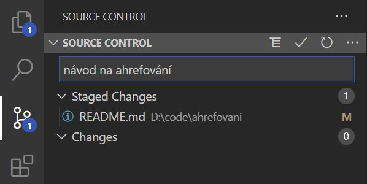

# Ahrefování
Přehled věcí, co jsme zatím probírali (a občas něco navíc).

- [Ahrefování](#ahrefování)
  - [Obecně](#obecně)
  - [HTML](#html)
    - [Základní pravidla](#základní-pravidla)
    - [Základní struktura](#základní-struktura)
      - [Odsazení (indentation)](#odsazení-indentation)
    - [Tagy](#tagy)
      - [Strukturní](#strukturní)
      - [Metadata](#metadata)
      - [Obsahové - blokové](#obsahové---blokové)
      - [Obsahové - inline](#obsahové---inline)
      - [Multimédia](#multimédia)
      - [Tabulky](#tabulky)
      - [Formuláře](#formuláře)
    - [Atributy](#atributy)
  - [CSS](#css)
    - [Základní pravidla](#základní-pravidla-1)
    - [Prakticky](#prakticky)
    - [Vkládání CSS do HTML](#vkládání-css-do-html)
    - [Selektory](#selektory)
    - [Vlastnosti](#vlastnosti)
      - [Písmo](#písmo)
      - [Barvy](#barvy)
      - [Mezery](#mezery)
      - [Rámečky](#rámečky)
      - [Zobrazení a rozměry](#zobrazení-a-rozměry)
  - [JavaScript](#javascript)
    - [Základní info](#základní-info)
    - [Praktická ukázka](#praktická-ukázka)
    - [Proměnné: `let`, `const`](#proměnné-let-const)
    - [Datové typy: string, number](#datové-typy-string-number)
    - [Operátory](#operátory)
    - [Podmínky: `if`, `else if`, `else`](#podmínky-if-else-if-else)
    - [Cykly: `for`, `while`](#cykly-for-while)
  - [Programy a nástroje](#programy-a-nástroje)
    - [DevTools (F12 v prohlížeči)](#devtools-f12-v-prohlížeči)
    - [Visual Studio Code (VSCode)](#visual-studio-code-vscode)
    - [Git](#git)
      - [Základní git flow](#základní-git-flow)
    - [node.js](#nodejs)
      - [NPM](#npm)
    - [ESLint](#eslint)

## Obecně
Webové programovaní se dnes prakticky odehrává ve třech různých jazycích. Každý má svůj účel:

- **HTML** (HyperText Markup Language, soubory s příponou `.html`) je _značkovací jazyk_. Definujeme s ním kostru **dokumentu** (tj. webové stránky). 
  - HTML neurčuje, jak bude dokument vypadat - říká jen "tohle je nadpis", "tohle je obrázek" - značení pomocí tagů je **sémantické**. Správně napsané HTML pak umí zpracovat třeba slepecké čtečky.
  - HTML soubor si prohlížeč "schroustá" do takzvaného **DOM** (Document Object Model). "Texťák" s tagy se tak převede do stromové struktury, která se skládá z jednotlivých **prvků (elements)**. K DOM pak přistupujeme přes další dva jazyky.
- **CSS** (Cascading Style Sheets, soubory s příponou `.css`) je _stylovací jazyk_. Definujeme s ním, jak bude dokument napsaný v HTML vypadat. 
  - CSS **pravidly** se řídí celý vzhled dokumentu - od jednotlivostí jako tučnost písma po **layout**, tedy celkové rozvržení stránky.
  - Z historických i praktických důvodů mají prohlížeče pro jednotlivé tagy **výchozí styly**. Proto bude mít dokument základní formátování, i když jsem žádná CSS pravidla nenapsal. Výchozí styly ale jdou libovolně přepsat vlastními pravidly.
- **JavaScript** (JS, soubory s příponou `.js`). je _programovací jazyk_. Umí stejné věci, co jiné programovaci jazyky - matematiku, práci s daty... Speciální je v tom, že je zabudovaný přímo do webových prohlížečů a můžeme s ním tak přistupovat k DOM a ovládat ho - JavaScript **oživuje webové stránky**.


Jedna z nejdůležitějších schopností při programování je orientace v dokumentaci. Všechny tři jazyky detailně dokumentuje web **[MDN (Mozilla Developer Network)](https://developer.mozilla.org/en-US/docs/Web)**. Ostatní zdroje (třeba W3Schools, které bývají první ve výsledcích na Googlu) jsou občas přívětivější, ale často nepřesné nebo zastaralé.

## HTML
Historie HTML byla plná mrzení, kdy se nikdo nemohl dohodnout, k čemu HTML vlastně bude, a každý prohlížeč si je zobrazoval jinak, ale na dnes aktuální verzi <b>HTML5</b> z roku 2014 je shoda a podoba HTML se tak naštěstí ustálila. Má i vlastní ošklivé logo:


### Základní pravidla
- Dokument píšeme tak, že jeho obsah obalujeme do sémantických **tagů**. Tag vypadá takhle: `<html>`
- Většina tagů je **párových** (počáteční tag `<html>` musí doplňovat koncový `</html>`), některé jsou ale nepárové.
- Tagy můžou mít **atributy**, které definují další vlastnosti - třeba unikátní ID prvku (to se používá hlavně v JavaScriptu), třídu (ta zase v CSS) nebo nutný doplněk tagu, třeba adresu obrázku pro tag ``. **Hodnota** atributu je vždy ve dvojitých uvozovkách.
- Takhle takový tag s atributy vypadá:
  ``
- Dokument má **stromovou strukturu**: i pokud bychom zmatlali HTML kód, třeba zapomenutím koncového tagu, a strom by byl rozbitý, prohlížeč ho při tvorbě DOM opraví.
- Do HTML můžu psát taky **komentáře**. Prohlížeč je při sestavování DOM bude ignorovat, takže si do nich můžu psát libovolné poznámky. Můžou být na víc řádků a uvozují se takhle:
  ```
  <!-- jednořádkový komentář -->
  <!-- 
    komentář na víc řádků!
    jupí!
  -->
  ```
  VSCode mi komentářové znaky automaticky vloží zkratkou `Alt+Shift+A` - to platí i pro další jazyky.
- To je vlastně všechno: celý HTML soubor je mix různých tagů s atributy a jejich obsahu, případně komentářů. Znalost HTML spočívá ve znalosti toho, který tag kdy použít a jaké má a nemá atributy.

### Základní struktura
Takhle vypadá základní HTML kostra (včetně tagů pro vložení stylu a skriptu - hodí se):

```
<!DOCTYPE html>
<html>
  <head>
    <meta charset="utf-8">
    <title>Název stránky</title>
    <link rel="stylesheet" href="style.css">
  </head>
  <body>
    <p>Text v odstavci.</p>
    <script src="script.js"></script>
  </body>
</html> 
```

Postupně:
- `<!DOCTYPE html>` je _deklarace_ typu dokumentu. Musí být na začátku každého HTML souboru. Říkáme s ní prohlížeči, že **používáme HTML5**. Bez deklarace si prohlížeč může vytvořit DOM všelijak, většinou špatně.
- Párový `<html>` uvozuje celý dokument.
- Párový `<head>` uvozuje "hlavičku", doplňující informace o dokumentu - nejsou vidět na samotné stránce.
- `<meta charset="utf-8">` je další povinný tag. Říká, že dokument používá univerzální znakovou sadu UTF-8, což znamená, že můžeme bezpečně používat české znaky nebo třeba emoji.
- Párový `<title>` uvozuje název stránky, který je v prohlížeči vidět v horní liště jako název tabu.
- `<link>` je tag pro vkládání _externích zdrojů_. Můžou to být třeba písma nebo náhledové ikonky, v našem případě to ale bude CSS soubor (to určuje atribut `rel` - _relationship_). Umístění ve složce se zadává do atributu `href`.
- Párový `<body>` uvozuje obsah dokumentu - to, co je vidět na stránce.
- Párový `<p>` (**paragraph**) je jeden ze základních obsahových tagů, uvozuje odstavec. 
- `<script>`se používá na vkládání JS (atribut `src` určuje umístění ve složce). Takhle použitý je sice prázdný, ale musí být párový. `<script>` patří tradičně vždy **na konec** `<body>` - je to proto, že se v něm manipuluje s DOM a prohlížeč ho tak musí "přečíst" až na konec, když je zbytek DOM vytvořený. (Existuje několik modernějších způsobů, jak toho docílit, ale tenhle je jednoduchý a funguje.)

#### Odsazení (indentation)
V HTML (ale i v CSS a JS) je počítači jedno, jak budou jednotlivé řádky odsazené - celý kód by klidně mohl být na jednom řádku. Správné odsazení je nutné kvůli čitelnosti! U HTML je navíc logické, protože kopíruje stromovou strukturu DOM. `Alt+Shift+F` ve VSCode odsadí kód automaticky.

### Tagy
Tagů je spousta (něco přes stovku), tady je přehled nejdůležitějších. Celý seznam je na [MDN](https://developer.mozilla.org/en-US/docs/Web/HTML/Element). (U **nepárových** tagů je upozornění, zbytek je párový.)

#### Strukturní
`<html>`, `<head>` a `<body>` - všechny párové a popsané výš.
#### Metadata
Píšou se do `<head>` a skoro všechny jsou popsané výš: `<meta>`, `<title>`, `<link>` a `<style>`. (Do toho posledního se píšou CSS pravidla, pokud je nechci mít ve zvláštním souboru.)

#### Obsahové - blokové
Píšou se do `<body>` a označují nebo oddělují **bloky** obsahu. "Blok" v praxi znamená, že se obsah blokových tagů odskočí na nový řádek. (Zajišťuje to výchozí CSS pravidlo `display: block;`).
- `<div>` (_division_) je **neutrální blokový tag**. Používá se, když se nehodí nic jiného, a prohlížeče mu kromě zmíněného `display: block;` nepřiřazují žádný výchozí styl.
- `<p>` (_paragraph_) značí **odstavec textu**. Zatímco `<div>` může obsahovat cokoliv - obrázky, tabulky, formuláře, další `<div>` - `<p>` se používá čistě pro text.
- `<h1>` až `<h6>` (_heading_) uvozují **nadpisy**. Měly by odrážet stromovou strukturu dokumentu: `<h1>` je nadpis na nejvyšší úrovni - začíná se s ním a ve výchozím CSS je mu přiděleno největší písmo - `<h6>` na nejnižší.
- `<hr>` (původně _horizontal rule_, nepárový) značí **tématický předěl**. Prohlížeče tagu z historických důvodů přiřazují vodorovnou čáru, ale jako všude platí, že se na to nemůžeme spolehnout a tag má čistě sémantický význam, který musíme doplnit CSS.
- `<ul>` a `<ol>` (_un/ordered list_) uvozují **seznamy** - ty v `<ol>` jsou typicky číslované. **Položky** v seznamu se uvozují párovým `<li>`.

#### Obsahové - inline
Píšou se do `<body>` a označují vlastnosti částí textu v bloku. V praxi zůstane text označený inline tagem na stejném řádku jako obsah před ním - tagy mají výchozí CSS pravidlo `display: inline;`.
- `<span>` je **neutrální inline tag**. Je to inline obdoba `<div>` - používá se, když se nehodí nic jiného, třeba když chci nějakému úseku textu přidat třídu.
- `<a>` (_anchor_) je **odkaz**. Má povinný atribut `href`, který určuje, kam odkaz povede.
- `<br>` (_break_, nepárový) značí **konec řádku**. Častá chyba je používat jedno nebo několik `<br>` za sebou na "odražení" odstavce od předchozího - odstavce mají správně být obaleny tagem `<p>`, kterému můžeme přiřadit CSS pravidlo `margin-bottom`.
- `<b>` (původně _bold_) a `<strong>` označují **výrazný text**. Sémanticky je mezi nimi rozdíl (viz [MDN](https://developer.mozilla.org/en-US/docs/Web/HTML/Element/strong#%3Cb%3E_vs._%3Cstrong%3E)), ale v praxi se docela zaměňují. Prohlížeče jejich obsah defaultně ztučňují (`font-weight: bold;`).
- `<em>` (_emphasis_) a `<i>` (_idiomatic_, původně _italics_) značí **zdůrazněný text**. Výchozí styl obou tagů je kurzíva (`font-style: italic;`), ale stejně jako u `<b>`/`<strong>` platí, že je mezi nimi sémantický rozdíl (viz [MDN](https://developer.mozilla.org/en-US/docs/Web/HTML/Element/em#%3Ci%3E_vs._%3Cem%3E)) a CSS pravidla bychom jim měli nastavit sami.

#### Multimédia
- `` (_image_, nepárový) vkládá <b>obrázek</b>. Má povinný atribut `src`, který určuje umístění obrázku, a neměl by chybět ani atribut `alt` - popisek toho, co na obrázku je, třeba pro čtečky.
- Existují taky nepárové tagy `<audio>` a `<video>`, kterými prohlížeče automaticky opatří vložený obsah audio/video přehrávačem. Dokumentace je na [MDN](https://developer.mozilla.org/en-US/docs/Web/HTML/Element#image_and_multimedia).

#### Tabulky
Nejjednodušší je ukázat základní tabulkové tagy v praxi. Kód:

```
<table>
  <thead>
    <tr>
      <td>Jméno</td>
      <td>Příjmení</td>
      <td>Počet bodů</td>
    </tr>
  </thead>
    <thead>
    <tr>
      <td>Jana</td>
      <td>Nováková</td>
      <td>10</td>
    </tr>
    <tr>
      <td>Dana</td>
      <td>Horáková</td>
      <td>12</td>
    </tr>
  </thead>
</table>
```

se defaultně zobrazí jako:

<table>
  <thead>
    <tr>
      <td>Jméno</td>
      <td>Příjmení</td>
      <td>Počet bodů</td>
    </tr>
  </thead>
    <thead>
    <tr>
      <td>Jana</td>
      <td>Nováková</td>
      <td>10</td>
    </tr>
    <tr>
      <td>Dana</td>
      <td>Horáková</td>
      <td>12</td>
    </tr>
  </thead>
</table>

#### Formuláře
Formulářových prvků je v HTML [spousta](https://developer.mozilla.org/en-US/docs/Web/HTML/Element#forms), my jsme zatím používali dva nejdůležitější.
- `<button>`, tlačítko.
  <button>Defaultní tlačíko</button>
- `<input>` (nepárový) je pole pro vkládání obsahu. Má atribut [type](https://developer.mozilla.org/en-US/docs/Web/HTML/Element/input#input_types) - nejčastěji `text` nebo `number` - a pár dalších, z nichž se nejvíc hodí `placeholder` (text, který zmizí po kliknutí do inputu) a `value` (výchozí hodnota), pro typ `number` potom `min`, `max` a `step`.
  Tag `<input type="number" placeholder="Vložte číslo" min="0" max="100" step="2">` se defaultně zobrazí takhle (je vidět, že je pole malé a chtělo by to nastavit mu aspoň CSS pravidlo `width`):
  <input type="number" placeholder="Vložte číslo" min="0" max="100" step="2">

### Atributy
Existuje několik **globálních atributů** - těch, které je možné přidat k jakémukoliv tagu. Zdaleka nejdůležitější jsou dva:
- `class` určuje **třídu** prvku. Pomocí tříd pak nejčastěji vybírám prvky v CSS. Stejnou třídu můžu použít pro víc prvků. Když chci, aby měl prvek víc tříd, píšu je za sebe s mezerou: `<p class="bold red underlined">`.
- `id` je **unikátní identifikátor** prvku. Používám ho nejčastěji pro výběr prvku v JS. Žádné dva prvky nesmí mít stejné ID (jinak JS nebude správně fungovat).

Názvy tříd i ID se tradičně píšou malými písmeny a [kebab-case](https://www.theserverside.com/definition/Kebab-case): `my-awesome-class`.

Některé tagy mají taky speciální atributy, které se s nimi dobrovolně nebo povinně používají. Třeba tag `` musí mít povinně atribut `src`, který říká, kde je daný obrázek umístěný.

## CSS
CSS mělo podobně jako HTML komplikovanou historii, než došlo do dnešní víceméně stabilní podoby. Poslední číslovaná verze je **CSS3**, ale protože se do CSS plynule přidávají nové věci, dnes už se neverzuje.

### Základní pravidla
- CSS popisuje **vzhled HTML dokumentu** a skládá se z **pravidel**.
- Prohlížeče v sobě obsahují nějaká základní **výchozí pravidla**, takže dokument má základní formátování, i pokud žádné CSS nedefinujeme. Například výchozí pravidlo pro `<b>` je tučné písmo. Výchozí pravidla ale můžeme s CSS přepsat.
- Pravidla jsou **kaskádová**. To znamená, že ve stromu dokumentu "tečou" z nadřazených prvků k podřazeným. Když nastavím třeba nějakému prvku `<div>` s mnoha podřazenými `<p>` velké písmo, budou mít velké písmo i všechny `<p>`.
- Prvky dokumentu můžu vybírat spoustou způsobů pomocí takzvaných **selektorů**. Selektor vybírá všechny příslušné prvky. 
  - Selektorem může být samotný **tag**. Například selektor `p` vybere všechny prvky s tagem `<p>`.
  - Nejčastěji je ale selektorem **třída**, kterou prvku přiřadím v HTML. Selektor třídy začíná tečkou: třeba `.my-awesome-class`, který vybere všechny prvky s touhle třídou: `<p class="my-awesome-class">`, `<h1 class="my-awesome-class">`...
- K selektorům píšeme bloky **vlastností (properties) s hodnotami**, které tím dáváme daným prvkům. (Bloky jsou části kódu ohraničené "chlupatými závorkami" `{}` - jako v JavaScriptu.) Vlastnosti se píšou jako `vlastnost: hodnota;`, s dvojtečkou a středníkem na konci.
- <b>Pravidlo</b> se tak skládá ze selektoru a bloku vlastností. Vypadá takhle:
    ```
    html {
      font-weight: bold;
    }
    ```
- I v CSS se můžou psát **komentáře**, takhle: `/* komentář */`. Ve VSCode můžu vložit komentářové znaky přes `Alt+Shift+A`.


### Prakticky
HTML kód
```
<div>
  <p>
    Kus tohohle textu bude <b>zvýrazněný</b>! Kus zase <span class="small">malý</span>.
  </p>
  <p class="small">
    Tenhle text bude malý.
  </p>
</div>
```

můžeme opatřit tímhle CSS:

```
div {
  font-family: Courier;
}

b {
  font-size: large;
}

.small {
  font-size: small;
}
```

Říkáme jím:
- Všechny prvky `<div>` (a tedy i všechny podřazené prvky - CSS je **kaskádové**) budou mít písmo Courier.
- Všechny prvky `<b>` budou mít větší písmo.
- Všechny prvky s třídou `small` budou mít o něco menší písmo. (V našem případě to bude `<span>` v prvním odstavci a celý druhý odstavec.)

Zobrazení bude takovéhle (`<b>` má navíc výchozí styl - tučné písmo.)

<p style="font-family: Courier;">
  Kus tohohle textu bude <b style="font-size: large;">zvýrazněný</b>! Kus zase <span style="font-size: small;">malý</span>.
</p>
<p style="font-family: Courier; font-size: small">
  Tenhle text bude malý.
</p>

### Vkládání CSS do HTML
CSS můžeme s HTML použít třemi způsoby:
- Ze samostatného souboru přes tag `<link>` v hlavičce. Je to nejlepší způsob organizace, protože drží různé jazyky odděleně. (Tomu se v programování říká **separation of concerns**.)
`<link rel="stylesheet" href="style.css">`
- Přímo v tagu `<style>` v hlavičce. Hodi se to jen u miniaturních dokumentů, kde jsou potřeba dvě tři pravidla.
  ```
  <style>
    p {
      font-weight: bold;
    }
  </style>
  ```
- Styly můžu psát i přímo do atributu `style` k jednotlivým tagům (bez selektorů - platí pak jen pro daný prvek), ale je to ošklivé, nesystematické a tady jen pro úplnost.
`<p style="font-weight: bold;">`

### Selektory
Základní typy selektorů jsou **tag** (`p`) a **třída** (s hvězdičkou, `.my-awesome-class`). Když chci, aby pravidlo platilo pro víc selektorů, odděluju je čárkou (`.my-awesome-class, .another-class`). Úplný přehled selektorů je na [MDN](https://developer.mozilla.org/en-US/docs/Web/CSS/CSS_Selectors).

### Vlastnosti
Vlastností je v CSS asi 200 (záleží na způsobu počítání). Tady je pár základních (celý přehled na [MDN](https://developer.mozilla.org/en-US/docs/Web/CSS/Reference)):

VSCode vlastnosti i hodnoty v CSS souborech sám našeptává.

#### Písmo
- `font-size`: velikost písma, nejčastěji v pixelech. Výchozí velikost písma v prohlížečích je většinou 16 pixelů: `font-size: 16px;`
- `font-weight`: tučnost písma. Základní hodnoty jsou `lighter`, `normal`, `bold`, `bolder`. Tag `<b>` má výchozí styl `font-weight: bold;`
- `font-family`: font, třeba `font-family: Courier;`. Je dobré používat nějaký základní - uživatel ho musí mít nainstalovaný, jinak uvidí výchozí font.
- <u>podtržené písmo</u> je `text-decoration: underline;`, <i>kurzíva</i> `font-style: italic`. Text můžu zobrazit <span style="text-transform: uppercase">velkými písmeny</span> pomocí `text-transform: uppercase`.

#### Barvy
Hodnotu barvy můžu zadávat několika způsoby - nejčastěji některým ze [zabudovaných názvů](https://htmlcolorcodes.com/color-names/) (`red`, `darkolivegreen`...) nebo RGB kódem (`#C0C0C0`, RGB kod z palety můžu získat [třeba tady](https://www.rapidtables.com/web/color/RGB_Color.html) a umí to i VSCode).
- `color`: barva textu. <span style="color: darkmagenta;">Tenhle text má `color: darkmagenta;`.</span>
- `background-color`: barva pozadí. <span style="background-color: yellow;">Tenhle text má `background-color: yellow;`.</span>

#### Mezery
Existují dva typy pravidel pro mezery: **padding** (vnitřní výplň) a **margin** (vnější mezera). Takhle:

<div style="background-color: yellow; padding: 20px">Tenhle prvek má nastavený 20pixelový <b>padding</b>.</div>

<div style="background-color: yellow; margin: 20px">Tenhle prvek má nastavený 20pixelový <b>margin</b>.</div>

Margin a padding můžu psát několika způsoby (vše s `padding` platí i pro `margin`):
- `padding: 10px` nastaví 10px ve všech čtyřech směrech.
- Jednotlivé směry můžu definovat jednotlivě: `padding-top` `padding-right` `padding-bottom` `padding-left`.
- Všechny směry taky můžu napsat do jediného pravidla `padding`. Jdou pak tak jako v předchozím bodě - **po směru hodinových ručiček**: `padding: 10px 20px 15px 25px;` je totéž jako 
  ```
  {
    padding-top: 10px;
    padding-right: 20px;
    padding-bottom: 15px;
    padding-left: 25px;
  }
  ```

#### Rámečky
Rámečky se definují pravidlem `border`, hodnota jde v pořadí tloušťka - typ - barva. Následující odstavec má nastaveno `border: 3px dotted green;`

<div style="border: 3px dotted green;">Brilantní rámeček</div>

Jednotlivé strany rámečku jdou taky definovat zvlášť přes `border-top` `border-right` `border-bottom` `border-left`.

#### Zobrazení a rozměry
- `display` určuje typ zobrazení prvku. Zatím se s tímhle pravidlem setkáváme díky výchozím stylům, které definují **blokové prvky** (`display: block;`, třeba `<p>`) a **inline prvky** (`display: inline;`, třeba `<b>`.) Blokové prvky tvoří samostatný "odstavec", inline můžu skládat vedle sebe na řádek. Za zmínku stojí i `display: none;`, kterým prvek úplně skryju.
- `width` a `height` určuje rozměry prvku. Následující `<div>` má `width: 100px;` a `height: 300px;`:

<div style="width: 100px; height: 300px; border: 1px solid">Odstavec, který zabírá zbytečně hodně výšky a absurdně málo šířky</div>

## JavaScript
Na rozdíl od HTML a CSS je JavaScript skutečný **programovací jazyk**. Je odvozený od stařičkého jazyka C, ve kterém je napsaný třeba Windows. První verze vznikla v roce 1995 hodně narychlo, což je na některých otravnějších vlastnostech JavaScriptu poznat. Časem se ale jazyk hodně posunul a postupně přibyla spousta vychytávek pro pohodlnější programování. Má oficiální specifikaci jménem ECMAScript, které se prohlížeče drží - každý rok do ní přibývají novinky a ta poslední je **ECMAScript 2020**.

Pozor, existuje i pořád celkem používaný jazyk Java, ale ten s JavaScriptem vůbec nesouvisí! JavaScript se původně jmenoval LiveScript, ale jeho tvůrci se v 90. letech rozhodli, že ho přejmenují podle tehdy masově populární Javy, což mělo k JavaScriptu nalákat programátory.

### Základní info
- JavaScript píšeme nejčastěji do samostatného souboru, který pak propojíme s HTML dokumentem tagem `<script>` (viz výše).
- Ke spuštění JavaScriptu potřebujeme takzvaný **engine**, který vykonává příkazy v kódu. Engine má v sobě zabudovaný každý prohlížeč. Dnes už enginy existují i samostatně (to znamená, že v JS jdou psát i normální "newebové" programy), ale pro zjednodušení se budeme držet toho, že JS zpracovává prohlížeč.
- JavaScript je **imperativní** - to znamená, že v něm píšeme sérii příkazů, které pak prohlížeč odshora dolů chroustá a provádí je. Příkaz vypadá třeba takhle: `const x = 2;`
- Základní principy jsou stejné jako při programování obecně:
  - Data - naše vlastní nebo třeba vstup od uživatele - si držíme v **proměnných**.
  - Data zpracováváme pomocí **funkcí** - buď vestavěných, tedy těch, které nám jazyk nabízí v základu, nebo těch, které si sami napíšeme.
- JavaScript je ale unikátní v tom, že může přistupovat k **DOM** (tedy zpracovanému HTML dokumentu).   
  - Můžeme pomocí něj vybírat prvky (nejčastěji pomocí **ID**) a měnit je - například jim přiřazovat **eventy**, takže budou reagovat na uživatele, třeba tlačítko na kliknutí.
- Do kódu můžeme psát **komentáře**, jedním ze dvou způsobů:
  ```
  // jednořádkový komentář
  /*
    komentář na víc řádků!
    jupí!
  */
  ```
  VSCode mi komentářové znaky automaticky vloží zkratkou `Alt+Shift+A`.

### Praktická ukázka

Můžeme si do HTML souboru přidat
`<p id="shopping-decider"></p>`

a propojit ho s JS souborem s obsahem:
```
const paragraph = document.getElementById("shopping-decider");
const randomNumber = Math.random();

let shouldIGoShopping;

if (randomNumber < 0.5) {
  shouldIGoShopping = "Ne!";
} else {
  shouldIGoShopping = "Ano!";
} 

paragraph.innerHTML = "Mám dnes jít nakoupit? " + shouldIGoShopping;
```

Pak se nám s 50procentní pravděpodobností ukáže odstavec _Mám dnes jít nakoupit? Ne!_, jinak _Mám dnes jít nakoupit? Ano!_.

Popořadě:
- `const paragraph = hodnota;` je **přiřazení do proměnné**, kterou jsme si pojmenovali `paragraph`. `const` znamená, že proměnnou není možné přepsat jinou.
- `document.getElementById();` je **vestavěná funkce**, která nám umožňuje vybrat prvek z DOM podle ID, které jsme mu nastavili. Do funkce píšeme v uvozovkách její jediný **parametr** `"shopping-decider"`, tedy ID našeho odstavce.
- `const paragraph = document.getElementById("shopping-decider");` tedy do proměnné `paragraph` přiřadí výsledek funkce `document.getElementById("shopping-decider");`, kterým bude náš odstavec.
- `Math.random();` je další vestavěná funkce, která vygeneruje náhodné desetinné číslo od 0 do 0,999.... My je přiřazujeme proměnné `randomNumber`.
- `let shouldIGoShopping;` nám **vytvoří prázdnou proměnnou**. Použití `let` znamená, že ji můžeme dál přepisovat (prázdnou `const` ani vytvořit nejde).
- `if (podmínka) { příkazy }` je **podmínka** - touhle říkáme, že pokud je naše `randomNumber` menší než 0,5, provedou se příkazy v následujícím bloku (blok ohraničují chlupaté závorky). Navazujícím `else { příkazy }` pak říkáme, co se stane, když podmínka nebude platit - tedy pokud je `randomNumber` rovné nebo větší 0,5.
- `shouldIGoShopping = "Ne!";` je **přepsání existující proměnné**, proto se už na začátek nepíše `let`. Do `const` by přiřazení nebylo možné, program by skončil chybou.
- Naše proměnná `paragraph` má různé **vlastnosti**, které popisují vybraný prvek v DOM. Přistupujeme k nim zápisem `proměnná.vlastnost`. Jednou z vlastností je ``innerHTML``: je v ní zapsaný celý HTML kód daného prvku. Ten je teď prázdný (do našeho `<p>` jsme v HTML dokumentu nic nenapsali), ale přiřazením do `paragraph.innerHTML` ho vyplníme.
  - `"Mám jít dnes nakoupit? " + shouldIGoShopping;` "slepí" text v první půlce s obsahem proměnné v druhé půlce.


<!-- 
### Vkládání JavaScriptu do HTML
--> 

### Proměnné: `let`, `const`

### Datové typy: string, number

### Operátory

### Podmínky: `if`, `else if`, `else`

### Cykly: `for`, `while`

## Programy a nástroje
V praxi se pro psaní kódu i jeho spouštění používá bambilion různých programů a nástrojů. S čím jsme se zatím potkali:

### DevTools (F12 v prohlížeči)
Největší pomocník každého webového programátora. V panelu **Elements/Inspector** vidíte DOM a je zároveň možné ho upravovat. V boxíku dole jde editovat styly - je dobré si stylování zkoušet v DevTools, než je napíšu do kódu. V panelu **Console** vidím výstupy z JavaScriptu a můžu tam taky rovnou psát a zkoušet javascriptový kód.

### Visual Studio Code (VSCode)
Editor od Microsoftu, který je napsaný ve variantě JavaScriptu a běží jako program ve Windows i jinde prostřednictvím nástroje **Electron** - v zásadě je to okno prohlížeče, které se tváří, že to není okno prohlížeče. (Fungují tak i třeba MS Teams nebo Discord.) Prostřednictvím tuny rozšíření podporuje spoustu vychytávek pro všechny možné programovací jazyky, má zabudovanou podporu Gitu.

VSCode i bez rozšíření umí spoustu klávesových zkratek, které zjednodušují psaní kódu. Nám se teď nejvíc hodí `Alt+Shift+F` - automatické naformátování souboru. Komentářové znaky vloží `Alt+Shift+A`.

### Git
Systém na **verzování** - správu verzí programu (ale i čehokoliv jiného). Historicky byla dost pruda spolupracovat na kódu a správně zaznamenávat změny po verzích. Git všechno tohle řeší a dnes už se prakticky nepoužívá nic jiného. Jednotlivým "složkám" s projekty se říká **repozitáře** (repositories). Je to děsně složitý nástroj, ale my z něj naštěstí potřebujeme jen pár věcí a VSCode ho přímo podporuje (ikonka Source control v panelu nalevo).



#### Základní git flow
* **Repozitář** mám jednak u sebe, jednak mám jeho dálkovou kopii - my k tomu používáme **GitHub**, hodně populární free službu od Microsoftu, která nám mj. umožňuje automaticky na web publikovat obsah repozitáře
* Jednotlivým verzím kódu se říká **commit**. Změny, které jsem udělal od předchozího commitu, vidím v git panelu ve VSCode jako *Changes*. 
* Když u nich kliknu na plusko, tak je takzvaně **stagenu** - staged soubory jsou "připravené na uložení". V panelu se přesunou do *Staged Changes*.
* Samotný commit by měl mít stručný komentář (**commit message**), kde shrnu, co v něm je. Ten se píše v panelu do boxíku nahoře. Když pak dám `Ctrl+Enter` nebo kliknu na fajfku nad boxíkem, commitou se všechny *Staged Changes* a pokud žádné nemám a všechno jsou jen *Changes*, automaticky se s tím všechny stagenou.
* Tím jsem změny uložil do svého repozitáře. V dolní liště vedle popisku "main" je pak ikonka, kde bude `↑ 1`, tzn. mám jeden commit k odeslání - **pushnutí** - do vzdáleného repozitáře (tj. na GitHubu). Když na ni kliknu, commit se pushne (a nám se i brzy publikuje na webu).

### node.js
JavaScript původně vznikl jako jazyk čistě pro prohlížeče. Pak se ale stalo, že ho uměli všichni a chtěli ho začít používat i jinde - pro programy, co běží přímo na počítači. Proto vznikl engine **node.js** (nebo jen Node), který přesně tohle umožňuje. My ho používáme hlavně kvůli **NPM**:

#### NPM
Zkratka z _Node Package Manager_. Je to databáze **knihoven** - "nesamostatných" programů, které můžu přidávat do svého repozitáře a které dělají různé věci. Může to být třeba knihovna na kombinatorické výpočty, knihovna, která dokáže ze vstupních dat dělat grafy, ale i různé pomocné knihovny, které programátorům usnadňují život.

NPM je zároveň program, který knihovny instaluje. V repozitářích si můžete všimnout souboru `package.json`, když ho otevřete, uvidíte kromě jiného seznam použitých knihoven. (Pak je ještě pomocný `package-lock.json`, který se generuje automaticky, ten zajišťuje, aby se knihovny správně instalovaly.)

### ESLint
Jediná knihovna, co zatím používáme. Kontroluje **správnost i "styl" JS kódu** podle toho, jak si ho nastavíme. My používáme jedno z nejpopulárnějších nastavení od **Airbnb** (zlí kapitalisté, dobří programátoři). Díky propojení s VSCode pak přímo v kódu vidíme červeně podtržené chyby a můžeme je často i automaticky opravit (kliknutím na `Quick Fix`).
